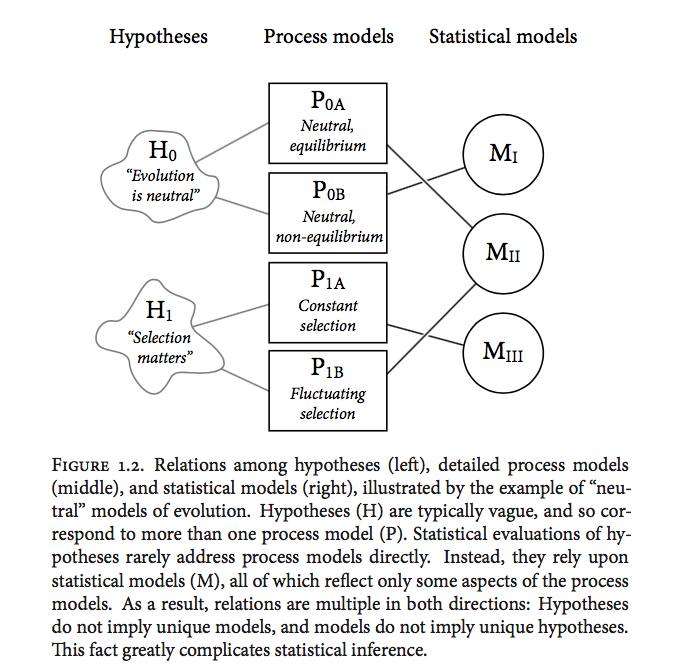

```{r setup, include=FALSE}
library(here)
here.pth <- here()
knitr::opts_chunk$set(echo = TRUE, root.dir = here.pth)
```

These are notes on chapter 1 for the book "Statistical Rethinking" by Richard McElreath

# Chapter 1: Golem of Prague

The golem is a metaphor for a model which could be conceptual, mathematical or statistical. The golem (model) executes instructions as told and the scientific insights might be inspired or challenged by how it behaves.


> models are powerful, but clumsy; they challenge and inspire intuition. 

> There is no wisdom in the golem 

> No statistical tool (or model) does anything on its own to address the basic problem of inferring causes from evidence

## The problem with inference

In the book the author makes a distinction between hypothesis and models. There is great difficulty sometimes to connect a vague scientific hypothesis with an underlying process and finally with a statistical model that is faithful to the process and the hypothesis.        

We want: $\text{cause} \rightarrow \text{effect}$, but we get $x$ associated with  $y$.



## The exponential family and maximum entropy

More in-depth treatment in later chapters. For now recognize that there are properties of these distributions which make them good at describing the variability in natural phenomena.

* Measurements matter: *modus tollens* $H \rightarrow D$, iff $\neg{D} \rightarrow \neg{H}$ 
* Observation error (ivory-billed Woodpeker and neutrino examples)
* Continuous hypothesis
* Falsification is consensual

## Tools for golem engineering

### Bayesian Data Analysis

* Frequentist as a special case of Bayesian (large samples - asymptotics)
* Sampling distributions (more than just normal), but only "in our imagination"
* Probability is not only frequency
* "If we had more information we could exactly predict everything" (I disagree with this statement, but it could potentially be fun to argue about it.)

### Model comparison and prediction

* Cross-Validation and Information Criteria

"Complex models make worse predictions than simpler models"

* Overfitting

"Fitting is easy; prediction is hard(er) and inference is harderer"

(I think here of inference as making cause and effect statements)

### Multilevel models

Also called: hierarchical, random effects, mixed effects, etc.

"Turtles all the way down"

Why multilevel models?

* To adjust estimates for repeat sampling
* To adjust estimates for imbalance in sampling
* To study variation
* To avoid averaging

"multilevel regression deserves to be the default form of regression"

### Graphical Causal Models

"Models that are causally incorrect can make better predictions"

"Causal salad means tossing various control variables into a statistical model, observing changes in estimates, and then telling a story about causation."

"There will never be a golem that accepts naked data and returns a reliable model of the causal relations among the variables. We're just going to have to keep doing science."

# Resources

* Github: https://github.com/femiguez/stat_rethink

* rethinking Github: https://github.com/rmcelreath/rethinking

* https://xcelab.net/rm/statistical-rethinking/

## Further reading 

* The Earth is round (p < 0.05). Jacob Cohen. 1994. American Psychologist
