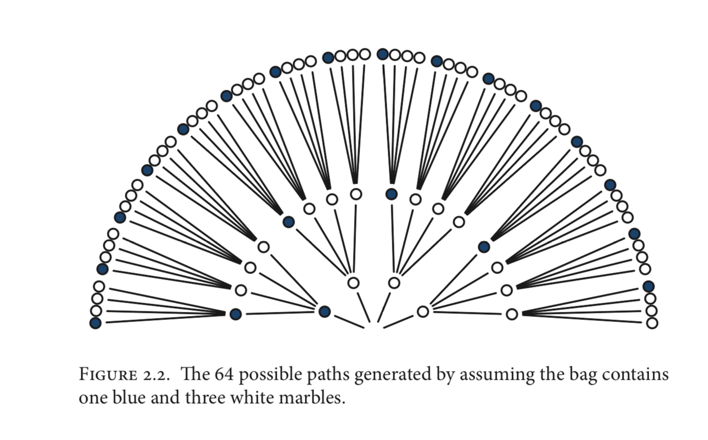
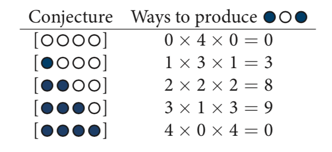

```{r setup, include=FALSE}
library(here)
here.pth <- here()
knitr::opts_chunk$set(echo = TRUE, root.dir = here.pth)
```

These are notes on chapter 2 for the book "Statistical Rethinking" by Richard McElreath

# Chapter 2: Small Worlds and Large Worlds

> The Small World is the self-contained logical world of the model

> The Large World is the broader context in which one deploys a model. The model is always an incomplete representation of the large world, and so will make mistakes.

## The garden of forking data

This is an effort at enumarating all possibilities as a way to illustrate probabilistic thinking.





### Conditional Probability

$$
P(A|B) = \frac{P(A \cap B)}{P(B)}
$$
https://en.wikipedia.org/wiki/Conditional_probability


On page 27 we get our first R code and also the definitions of 

* Parameter, a conjecture, such as the proportion of blue marbles ($p$)
* Likelihood, the number of ways a value $p$ can produce the data
* Prior probability, prior plausibility of $p$
* Posterior probability, the new updated plausibility of a specific $p$

These are arranged

$$ posterior = \frac{likelihood \times prior}{data} $$

### Grid approximation

### Quadratic approximation

### Markov chain Monte Carlo


# Resources

* Github: https://github.com/femiguez/stat_rethink

* rethinking Github: https://github.com/rmcelreath/rethinking

* https://xcelab.net/rm/statistical-rethinking/

## Further reading 


