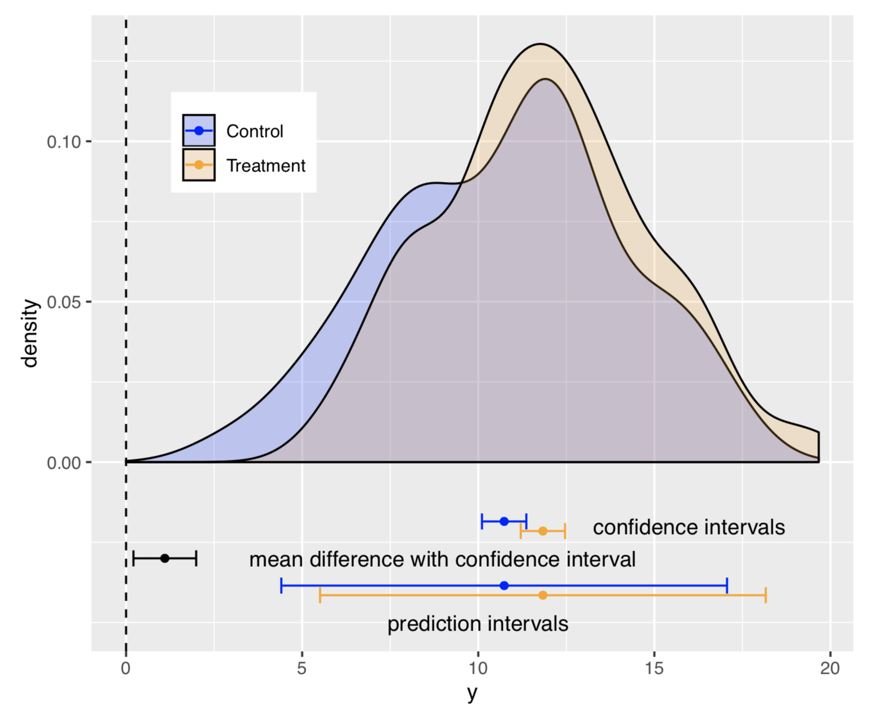

```{r setup, include=FALSE}
library(here)
here.pth <- here()
knitr::opts_chunk$set(echo = TRUE, root.dir = here.pth)
library(ggplot2)
library(nlraa)
library(car)
```

# Chapter 3: Sampling the Imaginary

> Vampire example, conditional probability and frequencies

> The Bayesian formalism treats parameter distributions as relative plausibility, not as any physical random process. In any event, randomness is always a property of information, never of the real world. 

I guess that with this last statement he is emphasizing that we can solve simple Bayesian problems using calculus and thus we do not need to add explicit randomness into the process. The method could be justified solely based on incomplete knowledge about the world and our subjective assessment of recognizing this ignorance. 

## Sampling from a grid-approximate posterior

Posterior for the globe tossing example

```{r post-globe}
p_grid <- seq(0, 1, length.out = 1000)
prob_p <- rep(1, 1000)
prob_data <- dbinom(6, size = 9, prob = p_grid)
posterior <- prob_data * prob_p
posterior <- posterior / sum(posterior)
## Simple visualization
## This helps visualize x and y here
plot(p_grid, posterior, type = "l")

## Samples from the posterior
## Not really necessary in this case
samples <- sample(p_grid, prob = posterior, size = 1e4, replace = TRUE)

## Plot
plot(samples)
plot(density(samples))

## Using samples to compute Rcode 3.7
sum(samples < 0.5)/length(samples)
```

## Sampling to summarize

* How much posterior probability lies below some parameter value?
* How much posterior probability lies between two parameter values?
* Which parameter value marks the lower 5% of the posterior probability?
* Which range of parameter values contains 90% of the posterior probability?
* Which parameter value has the highest posterior probabbility?

### Confidence, Credible, Compatible and Percentile Intervals, Oh my!

**Confidence**: Frequentists
**Credible** Bayesian
**Compatible** another Bayesian term

The problem is they are all often misunderstood.

**Frequentist** based on the idea that we could repeat the process many times. This is one useful way of conceptualizing probability, but not the only way.
**Credible** It has a more subjective connotation which is central to the Bayesian framework.
**Compatible** An attempt to emphasize that the interval is a summary of the posterior distribution which is compatible with the model and the data.

This last point is important as it implies that if we have bad data or a bad model or (Alas!) both then we have a bad interval. McElreath makes it very clear that good stats does not save us from bad science. Can we do good science while doing bad stats? It is possible, but let's try to avoid it.

A simple example:

```{r simple-mean}
set.seed(101)
## need nlraa package from github
x <- rnorm(12, 5, 2)
dat <- data.frame(x = x)
## Fit linear model
x.lm <- lm(x ~ 1, data = dat)
## Confidence intervals
confint(x.lm)
## Using bootstrap
lm.bt <- boot_lm(x.lm, R = 2e3)
## plot
hist(lm.bt, ci = "perc")
## Bootstrapped, confidence intervals
confint(lm.bt, type = "perc")
## Note I ran this model using Bayesian
## methods and I got a 95% CI of
## 4.55 - 6.21 
```

See this link for more detailed examples:
https://femiguez.github.io/paf/paf-0.html

## Prediction

The following figure shows the difference between a confidence and a prediction interval in the frequentist framework. Notice that the confidence interval is a statement about a parameter (i.e. the mean) and the prediction interval is a statement about an observation from that distribution.



## Sampling to simulate prediction

* Model design: sample from the prior and the posterior

* Model checking: posterior predictive check

* Software validation: let's just say that software sometimes doesn't work as intended

* Research design: related to *power analysis* but broader

* Forecasting: new predictions, cases and observations. I can see the future!

### Dummy Data Example

### Model Checking

* Did the software work?

* Is the model adequate?

**Observation uncertainty**: We do not know what the next globe toss will be.
**Parameter uncertainty**: We do not know $p$ exactly.

Propagating these two uncertainties results in a **posterior predictive distribution**.


# Resources

* Github: https://github.com/femiguez/stat_rethink

* rethinking Github: https://github.com/rmcelreath/rethinking

* https://xcelab.net/rm/statistical-rethinking/

* More: https://femiguez.github.io/paf/paf-0.html

## Further reading 


