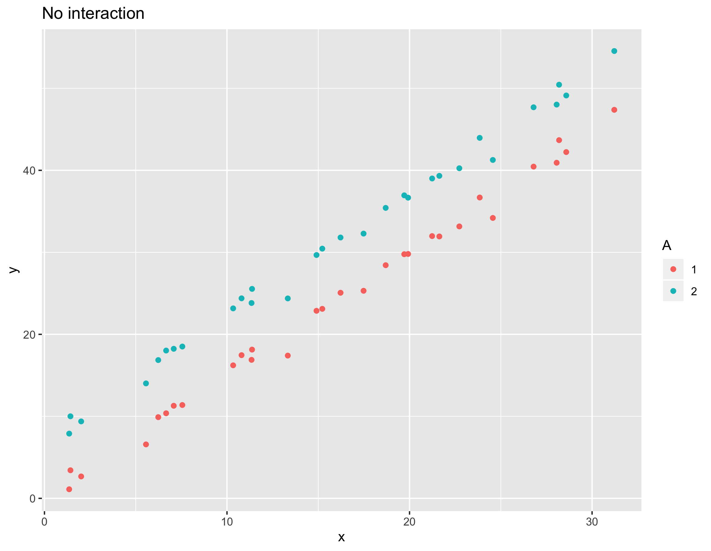
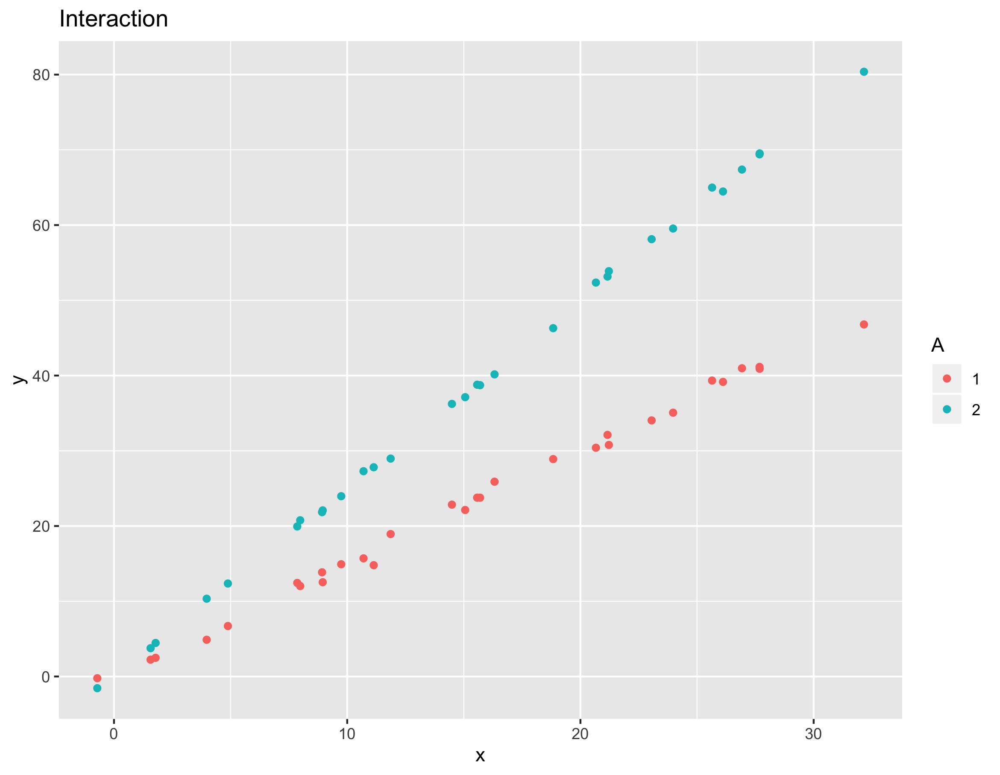
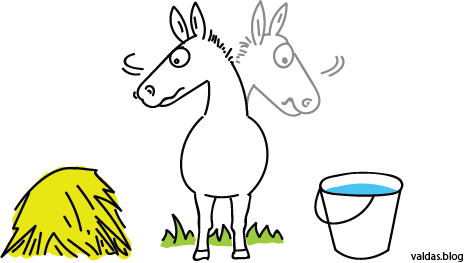
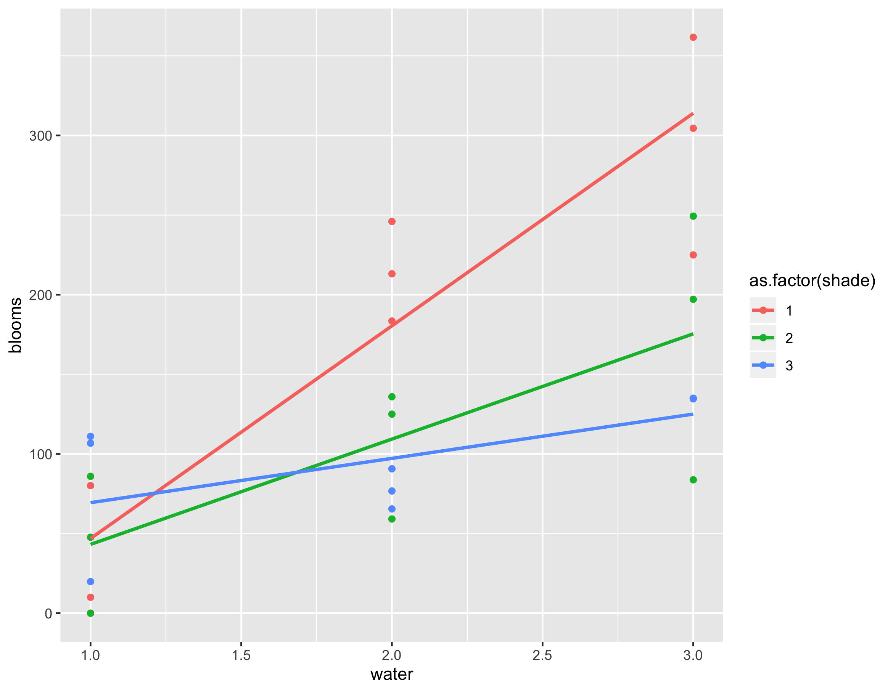
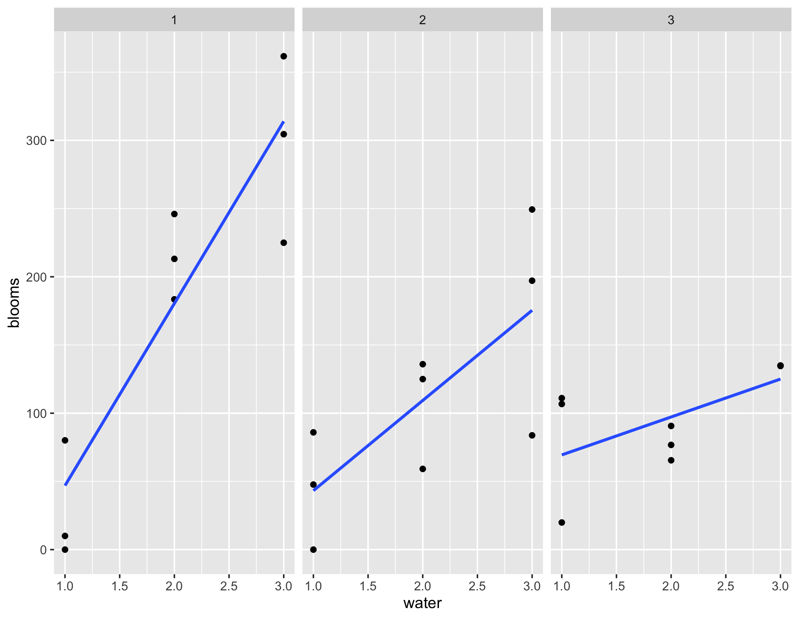

```{r setup, include=FALSE}
knitr::opts_chunk$set(echo = TRUE)
```

# Conditional Manatees

This chapter is all about interactions and it does get into the nuts and bolts about how they are built. Not as many crucial concepts and philosophical insights.

## Interactions

The first figure is an example of a lack of interaction. The difference between level 1 and level 2 of factor A is more or less constant across continuous factor x.



This second figure is an example of an interaction. The difference between level 1 and level 2 of factor A is not constant across continuous factor x.



This third figure is an example of a cross-over interaction. The difference between level 1 and level 2 of factor A is reversed across continuous factor x.


## Symmetry of interactions

> Interactions are like Buridan's ass. Like two piles of identical food, a simple interaction model contains two symmetrical interpretations

https://en.wikipedia.org/wiki/Buridan%27s_ass



On page 251 he poses two equivalent ways of thinking about the interaction. Only the first one makes sense to me.

What McElreath calls *counter-factual* plots are very useful for understanding interactions. 

## Tulips



